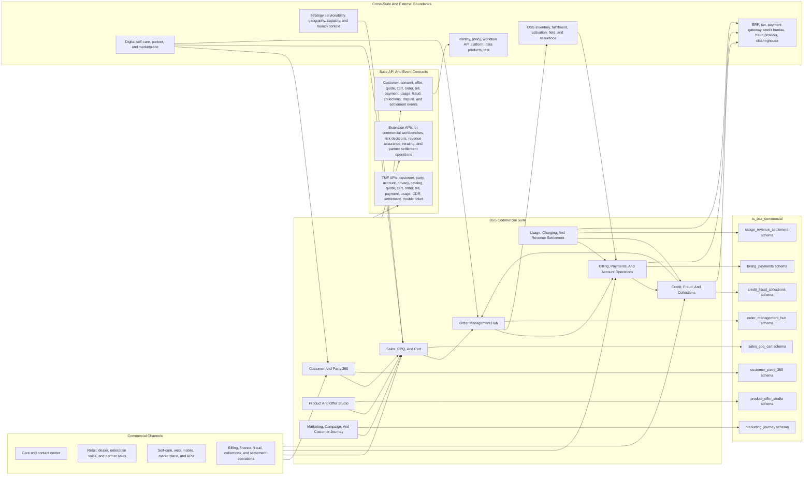
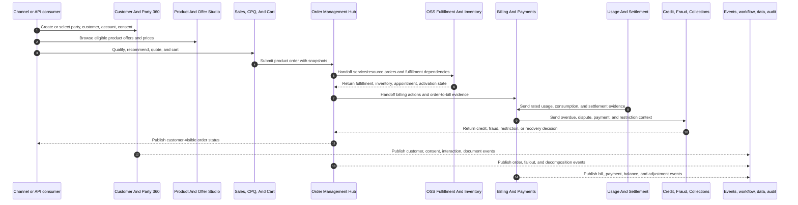
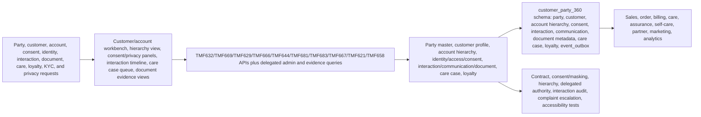
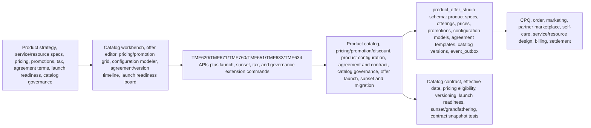
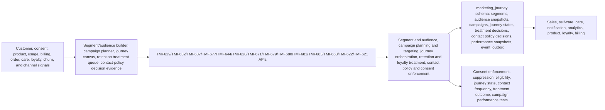
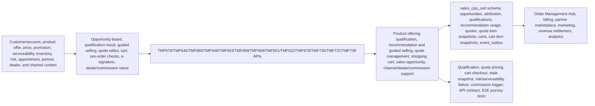
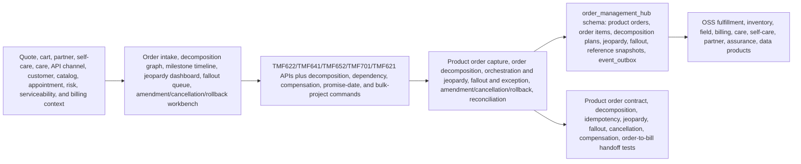
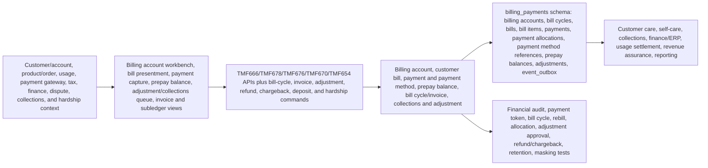
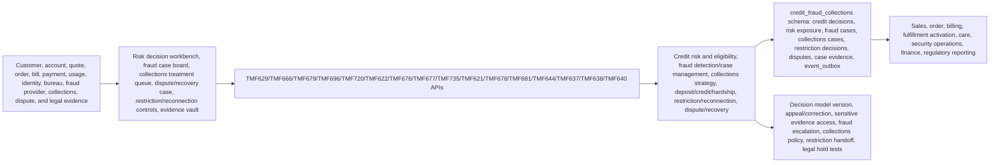
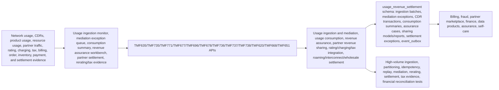

# BSS Commercial Architecture Diagrams

Reviewed: 2026-06-14

## Purpose

Use these diagrams when building the BSS Commercial suite and its apps. They turn the suite/app detail documents into architecture views for customer, offer, sales, order, billing, risk, usage, charging, and settlement implementation.

Primary sources:

- [Implementation File Usage Guide](implementation-file-usage-guide.md)
- [Tech And UI Guidance](tech-and-ui-guidance.md)
- [Data Model](data-model.md)
- [Journey Coverage](journey-coverage.md)
- App `implementation-file-usage.md`, `README.md`, `modules-and-features.md`, `personas-and-user-journeys.md`, and `features/` detail packs
- [TMF API To DDL Traceability Matrix](../tmf-api-to-ddl-traceability-matrix.md)
- `database/postgres/suites/ts_bss_commercial/`

## Suite Architecture

## Suite Build Flow

## App Architecture: Customer And Party 360

## App Architecture: Product And Offer Studio

## App Architecture: Marketing, Campaign, And Customer Journey

## App Architecture: Sales, CPQ, And Cart

## App Architecture: Order Management Hub

## App Architecture: Billing, Payments, And Account Operations

## App Architecture: Credit, Fraud, And Collections

## App Architecture: Usage, Charging, And Revenue Settlement

## Build Use

Use the suite diagram to decide commercial lifecycle ownership. Use each app diagram to create app-specific Angular routes, Spring Boot APIs, PostgreSQL entities, event contracts, privacy/audit policies, and release tests without crossing app schema write boundaries.
